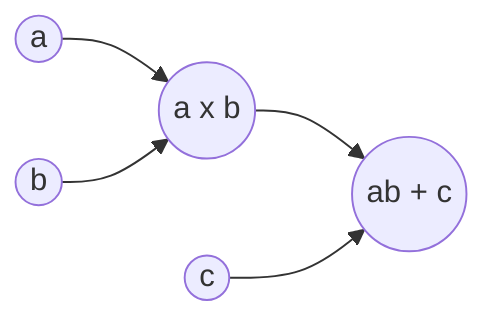

# Learning-Gan
 my notebook for learning gan network

- [Learning-Gan](#learning-gan)
  - [Implement the deep learning framework TensorPy by myself](#implement-the-deep-learning-framework-tensorpy-by-myself)

## Implement the deep learning framework TensorPy by myself

1. computing graph

$$
{
\left[ \begin{array}{cc}
2 & 1 \\
-1& -2\\
\end{array}
\right ]}
\times
{
    \left[\begin{array}{cc}
    1 \\
    1 \\    
    \end{array}
    \right]
}
 +
{\left[\begin{array}{cc}
    3\\
    3\\
\end{array}\right]
}=
{
    \left[\begin{array}{cc}
    6 \\
    0 \\    
    \end{array}
    \right]
}
$$

